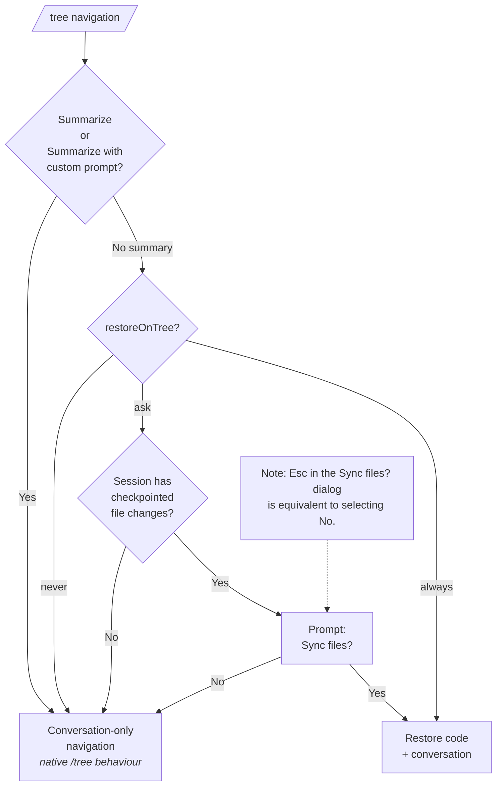

# @ayulab/pi-rewind

Pi extension providing the `/rewind` interactive checkpoint navigation command.

## Features

- Interactive checkpoint list with file-change statistics
- Rewind can restore a selected prompt to its pre-run code state (`beforeCommit`) so the turn can be run again
- Restore options for checkpoints with file changes:
  1. Restore code and conversation
  2. Restore conversation
  3. Restore code
- Conversation-only restore option when the checkpoint list has no file changes
- Optional file-state sync when navigating the Pi session tree (`ayu.rewind.restoreOnTree`) with `never`, `ask`, and `always` modes
- Auto-copy checkpoint storage on fork; fork restores the selected turn's `beforeCommit` and clone restores the cloned branch's latest `afterCommit` when enabled
- Fork, clone, resume, and `restoreOnTree: "always"` file restores overwrite checkpoint-managed files without a dirty-workspace prompt
- `/checkpoint` storage manager with `Current Folder` and `All` views, status-aware rows, and `Ctrl+D` delete in the TUI list
- Opening an existing session defaults to conversation-only; file restore for `/resume` and `pi -r` is opt-in via `ayu.checkpoint.restoreOnResume`
- File restore failures do not block conversation navigation, tree navigation, fork, or clone
- File-change stats shown for each checkpoint in the selection list
- Bundled checkpoint engine is emitted as a deterministic `@ayulab__pi-checkpoint.js` chunk for Pi package loading

## Dependencies

- `@ayulab/pi-checkpoint` — checkpoint engine
- `@earendil-works/pi-coding-agent` — Pi Extension API

## Installation

As part of the curated collection:

```bash
pi install npm:@ayulab/oh-my-pi
```

Or standalone:

```bash
pi install npm:@ayulab/pi-rewind
```

## Usage

The extension registers automatically after Pi starts, and captures checkpoints around each turn.

Use `/rewind` to jump back to any earlier turn and choose the exact restore scope you want:

- **Restore code and conversation** — roll both the workspace and the conversation back to the selected checkpoint
- **Restore conversation** — revisit an earlier idea without touching files
- **Restore code** — bring files back while keeping the current conversation position

It fits the moments when you want to:

- retry a prompt after fixing the code it generated
- inspect an earlier branch of thought without changing the workspace
- restore files from a checkpoint while staying on the current conversation path
- use `/tree` for navigation and decide whether file state should sync after Pi's native `No summary` choice

Use `/checkpoint` to inspect checkpoint storage state.

- `Current Folder` shows current-directory sessions that still have checkpoint storage, plus manifested `[no session]` orphan storage for that directory.
- `All` adds live sessions from every directory; sessions without checkpoint storage show `[no checkpoints]`, while manifested orphan storage shows `[no session]`.
- The right side shows status, cwd or path, message count, and relative time.
- `Ctrl+P` toggles path display.
- `Ctrl+D` deletes the selected non-current storage. Deleting storage keeps the Pi session record, but file restore for that session becomes unavailable. Deletion protects the current Pi instance's active session storage; it does not detect another Pi instance using the same storage. If a stale selector row points at storage that disappeared just before removal, the delete is treated as already complete. For `[no session]` orphan storage, `Ctrl+D` purges the residual storage directory even if the bare repo itself is already missing.

```
> /rewind

Recent checkpoints:
[1] add tests
   src/auth.test.ts +1 -0

[2] refactor auth
   2 files changed  +6 -2

[3] (current)

Select checkpoint: 1
Restore mode:
[1] Restore code and conversation
[2] Restore conversation
[3] Restore code

Select mode: 1
✓ Rewind completed
```

## Configuration

`pi-rewind` reads its settings from `ayu.rewind`, while checkpoint behavior comes from `ayu.checkpoint`. The `ayu` tree is merged recursively across scopes, so project settings override user settings field-by-field and missing values fall back to defaults.

Default behavior in phase 1:

- `/tree` keeps Pi's native conversation navigation and `ayu.rewind.restoreOnTree` defaults to `"ask"`, so no-summary tree navigation prompts before syncing files when the session has checkpointed file changes
- `ayu.rewind.restoreOnTree: "never"` disables file sync prompts and keeps `/tree` conversation-only
- `ayu.rewind.restoreOnTree: "always"` restores files automatically and overwrites checkpoint-managed workspace state to the target checkpoint
- `ayu.checkpoint.restoreOnResume` defaults to `false`, so opening an existing session does not modify files unless you opt in; when `true`, `/resume` and startup session selection such as `pi -r` overwrite checkpoint-managed files to the latest branch checkpoint
- `ayu.checkpoint.restoreOnFork` and `ayu.checkpoint.restoreOnClone` default to `false`; when enabled, they overwrite checkpoint-managed files to the fork or clone checkpoint state
- `/rewind` restores the selected turn's `beforeCommit`
- Existing-session and `/tree` restore failures for missing checkpoint storage are reported above the editor input using the warning theme and clear on the next user input. Whole-session storage loss is reported when entering an existing session with checkpointed file changes; a missing selected checkpoint is reported only when that file restore is attempted. `/rewind` reports missing restore storage through its command UI notification so conversation-only restore can still proceed.
- File restore failures are reported without silently proceeding; when conversation navigation is part of the action, it can still continue even if file restore fails, and rollback failure is surfaced explicitly

Example: keep a shared `ayu.rewind` default in user settings, then override just one field in the project.

```json
// ~/.pi/agent/settings.json
{
  "ayu": {
    "rewind": {
      "restoreOnTree": "never"
    }
  }
}
```

```json
// .pi/settings.json
{
  "ayu": {
    "rewind": {
      "restoreOnTree": "always"
    }
  }
}
```

Supported values:

| Setting    | Behavior                                                                                                                                                                                                                                                                                                                    |
| ---------- | --------------------------------------------------------------------------------------------------------------------------------------------------------------------------------------------------------------------------------------------------------------------------------------------------------------------------- |
| `"ask"`    | Default. When `/tree` is used with **No summary**, ask `Sync files?` if the session has ever produced checkpointed file changes; once any checkpoint changes files, later `/tree` prompts stay on during the session. When **Summarize** or **Summarize with custom prompt**, behave like native `/tree` (no file restore). |
| `"never"`  | Keep Pi-native `/tree` behavior; do not restore files or show the sync prompt.                                                                                                                                                                                                                                              |
| `"always"` | When `/tree` is used with **No summary**, restore files automatically without prompting and overwrite checkpoint-managed files to the target checkpoint state. When **Summarize** or **Summarize with custom prompt**, behave like native `/tree` (no file restore).                                                        |

`/rewind` code restore, fork, clone, and resume behavior are not controlled by `ayu.rewind.restoreOnTree`.

### Checkpoint settings

`ayu.checkpoint` controls checkpoint scope and restore defaults:

```json
{
  "ayu": {
    "checkpoint": {
      "restoreOnResume": false,
      "restoreOnFork": false,
      "restoreOnClone": false,
      "exclude": ["tmp/generated/**"],
      "include": ["tmp/generated/keep-me.txt"],
      "maxFileMB": 25
    }
  }
}
```

Rules:

- Built-in high-confidence generated and cache excludes are always applied first
- `ayu.checkpoint.exclude` appends more excludes
- `ayu.checkpoint.include` re-includes paths after those excludes
- `ayu.checkpoint.maxFileMB` is opt-in; when set, oversized changed files are skipped during checkpoint staging
- `ayu.checkpoint.restoreOnResume`, `restoreOnFork`, and `restoreOnClone` are opt-in; when set to `true`, automatic file restore overwrites checkpoint-managed workspace state without a dirty-workspace prompt. `restoreOnResume` is the single switch for opening existing sessions, including `/resume` and startup session selection such as `pi -r`
- `.pi/`, `.vscode/`, `vendor/`, `*.iml`, and `*.d.ts` are not excluded by default; only high-confidence personal IDE state such as `.idea/workspace.xml`, `.idea/tasks.xml`, `.idea/caches/`, `.idea/shelf/`, `.idea/localHistory/`, `.idea/compile-server/`, plus operating-system metadata such as `.DS_Store`, `Thumbs.db`, `Desktop.ini`, `*.iws`, `*.swp`, and `*.swo` is excluded automatically, including inside nested project directories

`restoreOnTree: "ask"` is session-scoped: the extension caches whether any checkpoint in the current session has ever changed files, seeds that cache from existing session history on session start, and updates it as new checkpoints are appended.

### /tree — file restore flow

When you navigate the session tree with `/tree`, the user is first asked whether to **Summarize**, **Summarize with custom prompt**, or produce **No summary**. The `restoreOnTree` setting determines what happens next:



In `restoreOnTree: "always"`, the file sync is a force restore: checkpoint-managed files are reset to the target checkpoint state, and untracked checkpoint-managed files are removed. Excluded paths and nested repository boundaries remain untouched.

## Nested repositories

Phase 1 keeps the existing nested Git safety boundary. If you start Pi from a broad workspace that contains nested Git repositories, the outer checkpoint excludes those nested repositories. `/rewind` and `/tree` still protect non-excluded files in the outer work tree, but they do not restore files inside those nested repositories from the outer session. To protect a nested repository, start Pi in that repository root.

## Session deletion

Pi currently exposes session switch, resume, tree, fork, and clone hooks to extensions, but not a dedicated session deletion hook for `pi -r` / `/resume` `Ctrl+D` deletion. Because checkpoint storage deletion is irreversible, `pi-rewind` does not infer deleted sessions or automatically garbage-collect durable checkpoint repositories.

Without a session deletion hook, `pi-rewind` handles lifecycle asymmetry this way:

- deleting checkpoint storage from `/checkpoint` never deletes the session record
- deleting checkpoint storage from `/checkpoint` only protects the current Pi instance's active session storage; other Pi instances using the same storage are not detected
- deleting a session elsewhere may leave orphan checkpoint storage on disk
- `/checkpoint` surfaces those orphan items as `[no session]` and lets the user remove them explicitly

If Pi adds a deletion lifecycle event such as `session_before_delete` or `session_deleted`, `pi-rewind` should use that exact hook to remove only the deleted session's matching checkpoint storage and clear related in-memory state.

## Development

```bash
pnpm run build    # tsdown bundle into dist/
pnpm run dev      # watch mode
pnpm test         # run tests
pnpm run coverage # coverage report
pnpm run typecheck# tsc --noEmit
```

## License

GPL-3.0
