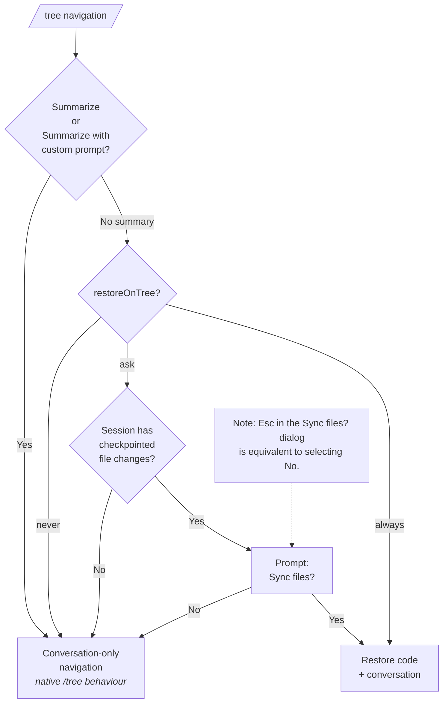

# @ayulab/pi-rewind

Pi extension providing the `/rewind` interactive checkpoint navigation command.

## Features

- Interactive checkpoint list with file-change statistics
- Rewind can restore a selected prompt to its pre-run code state (`beforeState`) so the turn can be run again
- Restore options for checkpoints with file changes:
  1. Restore code and conversation
  2. Restore conversation
  3. Restore code
- Conversation-only restore option when the checkpoint list has no file changes
- Optional file-state sync when navigating the Pi session tree (`ayu.rewind.restoreOnTree`) with `never`, `ask`, and `always` modes
- Shared Worktree Checkpoint Storage across sessions, forks, clones, and resumes in the same work tree
- File-change stats shown for each checkpoint in the selection list
- Bundled checkpoint engine is emitted as a deterministic `@ayulab__pi-checkpoint.js` chunk for Pi package loading

## Dependencies

- `@ayulab/pi-checkpoint` — checkpoint engine
- `@earendil-works/pi-coding-agent` — Pi Extension API

## Installation

As part of the curated collection:

```bash
pi install npm:@ayulab/oh-my-pi
```

Or standalone:

```bash
pi install npm:@ayulab/pi-rewind
```

## Usage

The extension registers automatically after Pi starts, schedules non-blocking cleanup of legacy per-session checkpoint storage, and captures checkpoints around each turn.

Use `/rewind` to jump back to any earlier turn and choose the exact restore scope you want:

- **Restore code and conversation** — roll both the workspace and the conversation back to the selected checkpoint
- **Restore conversation** — revisit an earlier idea without touching files
- **Restore code** — bring files back while keeping the current conversation position

It fits the moments when you want to:

- retry a prompt after fixing the code it generated
- inspect an earlier branch of thought without changing the workspace
- restore files from a checkpoint while staying on the current conversation path
- use `/tree` for navigation and only restore files when `ayu.rewind.restoreOnTree` is `ask` or `always`

```
> /rewind

Recent checkpoints:
[1] add tests
   src/auth.test.ts +1 -0

[2] refactor auth
   2 files changed  +6 -2

[3] (current)

Select checkpoint: 1
Restore mode:
[1] Restore code and conversation
[2] Restore conversation
[3] Restore code

Select mode: 1
✓ Rewind completed
```

## Configuration

`pi-rewind` reads its settings from `ayu.rewind`, while checkpoint behavior comes from `ayu.checkpoint`. The `ayu` tree is merged recursively across scopes, so project settings override user settings field-by-field and missing values fall back to defaults. By default, `/tree` keeps Pi's native behavior and only changes the conversation position; it does not modify files.

Example: keep a shared `ayu.rewind` default in user settings, then override just one field in the project.

```json
// ~/.pi/agent/settings.json
{
  "ayu": {
    "rewind": {
      "restoreOnTree": "ask"
    }
  }
}
```

```json
// .pi/settings.json
{
  "ayu": {
    "rewind": {
      "restoreOnTree": "always"
    }
  }
}
```

Supported values:

| Setting    | Behavior                                                                                                                                                                                                                                                                                                           |
| ---------- | ------------------------------------------------------------------------------------------------------------------------------------------------------------------------------------------------------------------------------------------------------------------------------------------------------------------ |
| `"never"`  | Default. Keep Pi-native `/tree` behavior; do not restore files.                                                                                                                                                                                                                                                    |
| `"ask"`    | When `/tree` is used with **No summary**, ask `Sync files?` if the session has ever produced checkpointed file changes; once any checkpoint changes files, later `/tree` prompts stay on during the session. When **Summarize** or **Summarize with custom prompt**, behave like native `/tree` (no file restore). |
| `"always"` | When `/tree` is used with **No summary**, restore files automatically without prompting. When **Summarize** or **Summarize with custom prompt**, behave like native `/tree` (no file restore).                                                                                                                     |

`/rewind` code restore, fork, clone, and resume behavior are not controlled by `ayu.rewind.restoreOnTree`. Resume is conversation-first by default: `ayu.checkpoint.restoreOnResume` defaults to `"never"`. Set it to `"always"` only if you want resuming a session to synchronize files automatically. Fork and clone remain `"always"` by default because they are explicit branch-entry actions.

`restoreOnTree: "ask"` is session-scoped: the extension caches whether any checkpoint in the current session has ever changed files, and `/reload` rebuilds that cache from the current session history.

### /tree — file restore flow

When you navigate the session tree with `/tree`, the user is first asked whether to **Summarize**, **Summarize with custom prompt**, or produce **No summary**. The `restoreOnTree` setting determines what happens next:



## Storage, cleanup, and restore boundaries

New checkpoints are stored once per resolved work tree under `~/.pi/agent/ayu/checkpoints/worktrees/<worktree-id>/`, with refs protecting each session/user-entry state. Sessions, forks, and clones opened in the same work tree share object storage instead of creating standalone per-session repos. Checkpoint commits are protected by explicit checkpoint refs rather than permanent branch history, so retention cleanup can delete expired refs and let Git GC reclaim unreferenced file-state objects.

The legacy per-session path `~/.pi/agent/ayu/checkpoints/sessions/` is removed asynchronously on startup. Old Pi sessions may still show conversation history, but legacy file snapshots from that path are not migrated or cloned into the new Worktree Checkpoint Storage.

Use `/checkpoint cleanup` to review cleanup before deleting anything. Dry-run is the default and shows counts plus sample orphan and retention-expired refs. `/checkpoint cleanup --apply` deletes legacy per-session checkpoint storage, removes orphan checkpoint refs, applies retention-expired ref cleanup, and runs git GC for affected Worktree Checkpoint Storage. It does not delete Pi conversation history or durable worktree directories. If live session scanning, ref validation, path validation, or cleanup preflight fails, cleanup fails closed and deletes nothing for that pass.

File restore covers checkpoint-managed files only: files under the session cwd that are not excluded by built-in defaults, `ayu.checkpoint.exclude`, `.gitignore`, nested `.gitignore`, or an optional `ayu.checkpoint.maxFileBytes` cap. Ignored, excluded, and configured-over-limit files are outside the restore commitment.

`ayu.checkpoint.exclude` appends to built-in defaults instead of replacing them. Defaults include dependency folders, generated build outputs, common caches, mobile/native build directories, IDE folders, logs, temp files, `.DS_Store`, and `Thumbs.db`. `vendor/` and `*.d.ts` are intentionally not default-excluded because they may contain source.

Dirty restore checks fail closed. If checkpoint-managed files contain unsnapshotted changes, restore is refused. If the dirty check itself fails, restore is also refused with a distinct verification-failed message instead of proceeding.

## Development

```bash
pnpm run build    # tsdown bundle into dist/
pnpm run dev      # watch mode
pnpm test         # run tests
pnpm run coverage # coverage report
pnpm run typecheck# tsc --noEmit
```

## License

GPL-3.0
